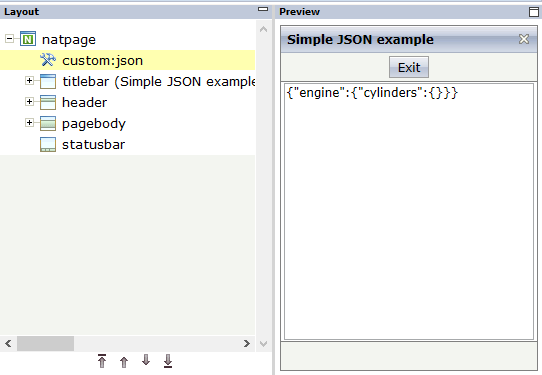

## Overview

When integrating external JavaScript libraries or Web Components in a Natural for Ajax&trade; application, there is often the need to pass JSON formatted data to such a  component. But creating JSON data is no inherent functionality in Natural&trade;. Natural is instead powerful in the handling of structures and arrays.

This project provides an invisible Natural for Ajax custom control **custom:json** that serves as a brigde between these concepts. Including an instance of this control in a  Natural for Ajax page generates a Natural data structure that matches a given JSON format and provides the mapping between that data structure and the JSON data at runtime. All Natural data types can be used in this context. 

## How does it work?

The control **custom:json** is added in the to a Natural Ajax page with the Layout Painter.

In the XML layout code this looks as follows:

	<?xml version="1.0" encoding="UTF-8"?>
	<natpage adapterlisteners="net.zerodrive.natural.njx.controls.custom.JSONAdapterListener" natsinglebyte="false" natkcheck="true" xmlns:njx="http://www.softwareag.com/njx/njxMapConverter">
    	<custom:json jsonobject="car" jsonmetadata="carmeta.json" jsonpretty="true">
    	</custom:json>

The control is configured with the parameters

- **jsonobject**: Defines the top level name of the data structure to which the JSON data is mapped
- **jsonmetadata**: A JSON file in the project subdirectory json that describes the JSON data format (see examples carmeta.json and testmeta.json)
- **jsonpretty**: Optional. If defined and set to true, it generates an additional  boolean field in the adapter that allows pretty formatting the JSON string for debugging purposes.

Example for a JSON data format description:

	{
		"type": "xs:string",
		"model": "xs:string",
		"color": "xs:string",
		"engine": {
			"power": "int",
			"displacement": "int",
			"cylinders": {
				"number": "xs:short"
			}
		}
	}

This results in the following adapter structure:

	DEFINE DATA PARAMETER
	/*( PARAMETER
	1 CAR
	2 COLOR (U) DYNAMIC
	2 ENGINE
	3 CYLINDERS
	4 NUMBER (I2)
	3 DISPLACEMENT (I4)
	3 POWER (I4)
	2 MODEL (U) DYNAMIC
	2 TYPE (U) DYNAMIC
	1 CAR_JSON (U) DYNAMIC
	1 CAR_PRETTY (L)
	/*) END-PARAMETER
	END-DEFINE

At runtime, with every roundtrip to the web frontend, the data in the data structure CAR is converted to JSON format in the variable CAR_JSON. And it is converted back at return from the roundtrip.

The runtime conversion is achieved by an adpter listener that must be assigned to the Natural Ajax page, as shown in the above XML code example.

## Installation

### If you are using Git

- Clone the project into a local directory.
 
		git clone https://github.com/zerodrive/NJX-ZDCustom .

- Import the project into your NaturalONE&trade; workspace.
 
		> Import > Existing projects into workspace

- Download json-simple-3.1.1.jar from [https://cliftonlabs.github.io/json-simple](https://cliftonlabs.github.io/json-simple "https://cliftonlabs.github.io/json-simple") and put the .jar file into the directory appclasses/lib in your project. Credits to Clifton Labs for thie nice JSON processor, that does the major work for us.

- Adapt the classpath file .classpath to the right paths of cis.jar and sdo.jar in your NaturalONE workspace.

- Build the project.

- Run the simple example CAR-P and the more complex example TEST-P. 

### If you are not using Git

- Select "Download ZIP". 

- Unzip the zip file into a local directory.

- Import and proceed as above.

## Trademarks, registered trademarks and license issues

- Natural, NaturalONE and Natural for AJAX are trademarks or registered trademarks of [Software AG](http://softwareag.com "Software AG").  
- Eclipse is a trademark or registered trademark of [Eclipse Foundation](http://eclipse.org "Eclipse Foundation").  
- zerodrive is a registered trademark of [zerodrive UG (haftungsbeschränkt)](http://zerodrive.net "zerodrive UG (haftungsbeschränkt)").    
- cliftonlabs/json-simple is licensed under the Apache License 2.0. 
- NJX-ZDCustom is licensed under the MIT license.